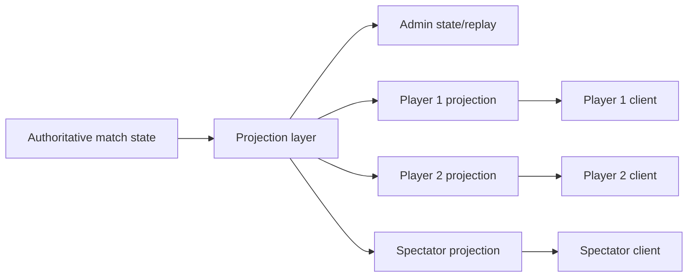

# Client Architecture

Status: proposed next architecture slice

Millet currently has a strong Studio/Admin client. It is excellent for server setup, ruleset debugging, replay inspection, content authoring, and local hotseat dogfooding because it can see both players' hands and can exercise any authored action. That is intentionally not the player experience.

The next client milestone is to split runtime clients by trust level and viewer role.

## Goals

- Build player clients that only receive information their player is allowed to know.
- Preserve the existing Studio/Admin surface as a privileged debugging and authoring tool.
- Make spectators first-class viewers with public board state and no command authority.
- Keep hidden information enforcement on the server, never in CSS or client-only filtering.
- Reuse the same match APIs, event stream, behavior metadata, board layouts, and presentation catalogs.

## Client Types

| Client | Viewer context | State access | Command access | Primary use |
| --- | --- | --- | --- | --- |
| Studio/Admin | `admin=true` plus admin authorization | Full state, full replay, all private fields | Debug/force tools and normal commands | Authoring, debugging, local hotseat, replay analysis |
| Player | Authenticated `playerId` mapped to the seated user | Own private state plus public opponent state | Only commands for that player | Real gameplay |
| Spectator | Public viewer or authenticated spectator | Public state only | None | Watch matches, broadcast, QA |

The current browser demo should be treated as the Studio/Admin client. A networked game should not evolve by hiding pieces inside that UI; it should consume projected player/spectator state from the server.

## Information Boundary

The server projection layer is the security boundary.

Player and spectator clients must never receive opponent card template ids, hidden role ids, hidden deck order, private prompt payloads, or admin-only random choices unless the ruleset marks that information public.

Hidden objects should arrive as redacted objects, for example:

- object type: `hidden`
- no `templateId`
- no private owner/controller fields unless allowed
- no stats, counters, tags, keywords, attachments, modifiers, or exhausted state unless public

The player client renders those objects as card backs, hand counts, deck counts, or hidden-role markers.

## Server Contracts

Player clients should use the same match service, but always with a viewer identity.

Core read paths:

- `GET /matches/:id/state?playerId=p1`
- `GET /matches/:id/replay?playerId=p1&fromSequence=N`
- `GET /matches/:id/events?playerId=p1&fromSequence=N`
- WebSocket stream with the same authenticated viewer mapping

Admin-only read paths:

- `GET /matches/:id/state?admin=true`
- `GET /matches/:id/replay?admin=true`

Command path:

- `POST /matches/:id/commands`

Command authorization remains server-side. Even if a malicious client sends a command for another player, selects a hidden opponent object, or references an object it should not know about, the match service must reject before mutation.

## Player Client Shell

The player client should be a separate runtime shell from Studio.

Recommended first slice:

- route: `?client=player&playerId=p1` or a dedicated package such as `packages/player-client`
- no authoring panels
- no admin replay button
- no project editor controls
- no local draft overlays
- no force/debug actions
- one selected viewer identity for the whole session

The shell still loads:

- ruleset `game-definition.json`
- board layout
- presentation catalog
- asset manifest
- projected match state
- projected replay/events

## Rendering Model

The runtime renderer should distinguish between object visibility and object layout.

Public zones:

- battlefield/creatures/minions
- lands/equipment/judgment/public delayed areas
- public discard and graveyard
- public hero/player cards

Private zones:

- own hand: real cards and actions
- opponent hand: hidden card backs and count
- own deck: count, maybe top card only if a ruleset effect reveals it
- opponent deck: count only
- hidden identity/role zones: redacted markers unless public or owner-visible

The board layout document can still define where zones appear. The player client decides what component to render for projected object types:

| Projected object | Player-client render |
| --- | --- |
| visible card/minion/equipment | full card surface from presentation catalog |
| `hidden` object in opponent hand | card back |
| `hidden` role | hidden role badge |
| public pile with hidden contents | count plus public top card only if projected |
| missing/private prompt | no prompt UI |

## Action Model

The player client should render only actions that are legal for the viewer's projected state.

Initial pragmatic model:

- Use presentation-authored actions for source cards the viewer controls.
- Use `sourceZoneKinds` and `targetZoneKinds` to choose zone-appropriate action buttons.
- Submit commands through the normal command endpoint.
- Let the server be the final legality authority.
- On rejection, show a compact client error and refresh projected state.

Future stronger model:

- Add a legal-actions endpoint or projected action manifest.
- Include target candidates from the server, already projection-safe.
- Let clients render drag/select targets without reimplementing selector legality.

That future endpoint would remove more rules interpretation from clients.

## Prompt Model

Prompts are part of projected state.

Player clients should render a prompt only when:

- the prompt is open,
- the current viewer is a responder,
- the prompt payload survives projection,
- the prompt type has a known renderer or generic fallback.

Spectators should see public prompt summaries, not private answer choices. Admin sees full prompt internals.

## Event And Replay Model

Player clients should subscribe to projected event streams and apply events to projected state, or fetch projected state after each event batch.

Rules:

- Event streams must be projected with the same viewer context as state.
- Redacted event payloads should not reveal hidden object ids or templates.
- Admin replay remains the debugging truth.
- Player replay is for UX, animations, and reconnect, not forensic debugging.

## Authentication And Sessions

The prototype already maps user/session headers to seated players for command and private projection authorization. A production client needs a real session layer:

- login/session cookie or token
- match seat claim/join flow
- `userId -> playerId` mapping stored server-side
- spectator authorization policy
- reconnect using last seen sequence
- no trusted `playerId` from browser query params without server verification

For local development, query/header-driven viewers are acceptable, but the player client should be written as if the server owns the identity mapping.

## First Milestone

Build the smallest real player client:

1. Add a player-client route or package.
2. Start or join a `sample-mana-clash` match as `p1` or `p2`.
3. Fetch projected state as that player.
4. Render own hand as real cards.
5. Render opponent hand as card backs/count only.
6. Render public board, heroes, lands, graveyard, and deck counts.
7. Allow own legal-looking actions and submit commands.
8. Subscribe or poll projected events.
9. Reject admin-only data in the client by construction.

Acceptance checks:

- P1 cannot see P2 hand template ids in DOM, network payload, logs, tooltips, or replay.
- P2 cannot see P1 hand template ids.
- Spectator sees neither hand.
- P1 can play/tap a Mana Clash land from their own hand.
- P1 cannot submit a command as P2.
- A two-browser Mana Clash match can advance turns and reconnect without leaking secrets.

## Follow-On Milestones

After the first player shell works:

- Add spectator client mode.
- Add projected legal-action metadata.
- Add private prompt renderers for response windows.
- Add reconnect UI using projected replay from `lastSequence`.
- Add table/lobby/session joining.
- Add match completion and post-game replay views.
- Add end-to-end tests that inspect network payloads for hidden-information leaks.

## Design Principle

The Studio client helps authors and server developers see everything. The player client helps players see only their seat in the world. Both are valuable, but they are different products with different trust boundaries.
