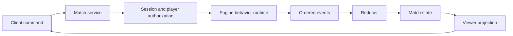

# Core Concepts

Millet models a game as deterministic state plus ordered events. Rulesets define what commands are legal, what effects they produce, what each player can see, and how turns advance.

## Mental Model



## Match State

The match state is the source of truth for:

- players and their status, such as `alive`, `dying`, `dead`, or connected state
- resources, such as health, mana, fatigue, and identity-game hand limits
- zones, such as hand, deck, board, weapon, judgment, discard, and graveyard
- objects, such as cards, minions, equipment, delayed tricks, and hidden role cards
- turn state, phase state, action windows, prompts, scheduled timers, and outcomes

State is not mutated directly by clients. Clients submit commands, and the engine emits events.

## Events

Events are append-only facts such as:

- `object_created`
- `card_moved`
- `resource_changed`
- `damage_dealt`
- `prompt_opened`
- `prompt_answered`
- `turn_advanced`
- `outcome_declared`

The reducer applies events in sequence. Replaying the same event list must produce the same state hash.

## Commands

A command is a player or system request. Common command types include:

- `execute_behavior`, used to play a card, activate an ability, or run a rules module
- `prompt_response`, used to answer an open prompt
- `end_turn`, used by the active player to advance the phase graph

The match service checks that the session can act for the command player before the engine mutates anything.

## Behaviors

A behavior is a structured rules definition with optional costs, selectors, conditions, effects, text metadata, and UX hints.

Example shape:

```ts
{
  id: "firebolt",
  kind: "card",
  costs: [{ type: "spend_resource", player: "controller", resource: "mana", amount: 2 }],
  selectors: [{ id: "target", from: "players", count: { min: 1, max: 1 } }],
  effects: [
    { type: "deal_damage", to: { selector: "target" }, amount: 3 },
    { type: "move_card", object: "self", toZoneId: "zone_discard" }
  ]
}
```

The important design choice is that behavior is structured data, not one-off imperative UI code. That allows validation, projection checks, text/UX sync, replay, and future LLM-assisted behavior authoring.

## Selectors

Selectors describe player choices. They define:

- what can be selected
- how many selections are required
- whether targets must be alive, not self, in range, in a zone, or controlled by a player

Selectors are validated before effects run.

## Prompts And Response Windows

Prompts model interactive windows such as mulligans, dodge responses, rescue windows, or priority loops.

Supported response patterns include:

- single responder
- all responders in order
- any responder until success
- priority loop until everyone passes after the latest response

The server can schedule guarded default passes so inactive clients do not block the match forever.

## Phase Graphs

A phase graph defines turn flow. For `sample-duel`:

```text
turn_start -> resource_refresh -> draw -> main -> turn_end
```

Entry behaviors can run at each phase. An action window pauses the graph until a player command, prompt answer, timeout, or turn transition continues it.

## Visibility Projection

The same state is projected differently for different viewers:

- the owner can see their hand
- opponents see hidden placeholders
- public board and weapon objects are visible to everyone
- hidden-role rulesets reveal only information the viewer is allowed to know
- admins can request full state for debugging and local hotseat demos

Projection is a first-class engine concern because multiplayer games should not rely on clients to hide secrets.

## Ruleset Bundle

A ruleset bundle includes:

- game definition
- card catalog
- behavior manifest and runtime behavior definitions
- localization strings
- asset metadata

The content build layer validates cross-file references and creates stable content hashes.

## Reference Rulesets

`sample-duel` demonstrates:

- two players
- health, mana, fatigue
- spells, minions, weapons
- turn phases and main action prompts
- win, loss, and draw outcomes

`sample-identity` demonstrates:

- six/eight-player seating
- hidden roles
- dying/rescue/death flow
- range and equipment
- delayed judgment cards
- dodge and nullification response windows
- camp-based win conditions

